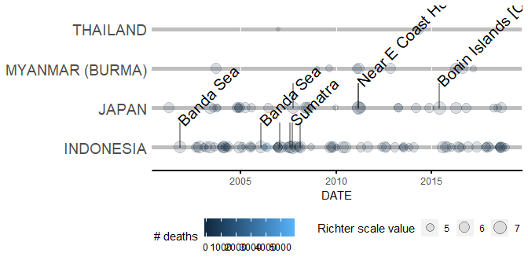
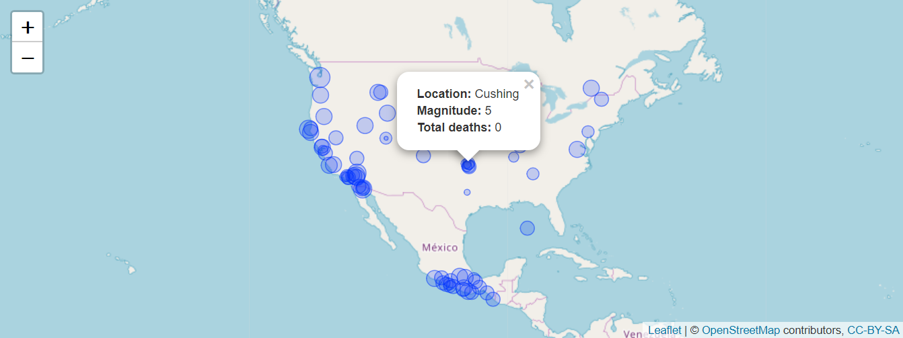

[](https://travis-ci.org/AndersonUyekita/JHU_MSDR_Capstone)

# Mastering Software Development in R Specialization Capstone

#### Tags
* Author       : AH Uyekita
* Date         : 21/fev/2019
* Course       : Mastering Software Development in R Specialization Capstone
* Project      : Capstone Project
    * COD      : MSDR
    * Instructor: Roger D. Peng
    * Instructor: Brooke Anderson

#### Installation

You can use this package installing it by the use of [`devtools`][url_devtools] library from R.

```
# Downloading the package
devtools::install_github("AndersonUyekita/JHU_MSDR_Capstone")

# Loading the library
library(msdr)
```

[url_devtools]: https://cran.r-project.org/web/packages/devtools/index.html

#### Vignettes

I have disclosed the principal Vignette in the RPubs.

* <a href="http://rpubs.com/AndersonUyekita/vignette_mastering_software_development_in_r" target="_blank">MSDR Vignette</a>

#### Bookdown

The Bookdown is a compendium of all functions of this package.

* <a href="https://andersonuyekita.github.io/JHU_MSDR_Capstone/" target="_blank">MSDR Capstone Bookdown</a>

********************************************************************************

## Introduction

This package is the outcome of the Mastering Software Development in R Capstone.

### Description

The package is tailored to work with the [NOAA][noaa_website] (National Oceanic Atmospheric Administration) [Earthquake database][noaa_earthquake].

[noaa_website]: https://www.ngdc.noaa.gov
[noaa_earthquake]: https://www.ngdc.noaa.gov/nndc/struts/form?t=101650&s=1&d=1

This database has 6,086 observations and 47 features (database downloaded in 20/feb/2019), which 4,283 observations are about earthquake and 1,803 with `FLAG_TSUNAMI` as true.

From this 4,283 observations, there are 27 with negative `YEAR` and 4,256 with positives values. Finally, from this last subset 1,305 observations have no `EQ_PRIMARY` (Magnitude in [Richter Scale][ritcher_scale]), which means they are recorded as `NA`, so there are only 2,951 valid observations.

[ritcher_scale]: https://simple.wikipedia.org/wiki/Richter_scale

### Objectivies

Development a new package capable to plot a timeline using the ggplot2 as bedrock. I have also created a function to deal with maps ([OpenStreet maps][openstreet_url]) and earthquake information.

[openstreet_url]: https://www.openstreetmap.org

### Functionalities

The package has 6 functions, which could be easily used, 2 functions with some restrictions of use (because it is not so easy to use), and 1 theme.

#### `eq_clean_data`

This function loads a given file_name and then performs the data cleaning. Undercover of this process these functions call the `eq_location_clean` to creates a new column called `LOCATION`.

Have in mind, this function also perfoms the conversion of data to the proper class type.

#### `eq_create_label`

Combines three columns to creates a new one with `HTML` structure, this is necessary because the Leaflet package requires the data to be displayed inside of the popup as HTML format.

#### `eq_location_clean`

Adds the `LOCATION` column. The dataset must have the `LOCATION_NAME`. If not the function will not work properly.

#### `eq_map`

Draw an OpenStreet Map and circles representing the earthquake's location. The popups show the date of the event. All this feature built over the [Leaflet][url_leaflet] package.

[url_leaflet]: https://rstudio.github.io/leaflet/

#### `geom_timeline`

Plot a timeline based on magnitude (`EQ_PRIMARY`) and total deaths (`TOTAL_DEATHS`).

#### `geom_timeline_label`

Given a plot of `geom_timeline`, this function annotates labels to the `n_max` earthquakes with the highest magnitude (`EQ_PRIMARY`).

#### `theme_msdr`

A theme to remove the background, grid, axis ticks, etc. Aims to increase the ink ratio of the plot.

There are two more functions, but these two has its works "hidden".

#### `GeomTimeline`

Creates all visuals to be plotted by the `geom_timeline`.

#### `GeomTimelineLabel`

Creates all visuals to be plotted by the `geom_timeline_label`.

## Examples

Some simple examples using the package.

#### Timeline

This example shows how to use `eq_clean_data`, `geom_timeline`, `geom_timeline_label`, and `theme_msdr`.

```r
# Loading the data.
df_clean <- eq_clean_data(file_name = raw_data_path)

# Subsetting the df_clean to select some countries in Asia.
df_asia <- df_clean %>%
       dplyr::filter(COUNTRY %in% c("INDONESIA","THAILAND", "MYANMAR (BURMA)", "JAPAN"),
                     YEAR > 2000 & YEAR <= 2019)

# Plotting.
df_asia %>%
       ggplot2::ggplot() +

              # Defining the aes.
              msdr::geom_timeline(ggplot2::aes(x     = DATE,
                                               y     = COUNTRY,
                                               size  = EQ_PRIMARY,
                                               color = TOTAL_DEATHS) +
       # Adding theme
       msdr::theme_msdr() +

              # Editing the legends' titles
              ggplot2::labs(color = "# deaths",
                            size  = "Richter scale value") +

       # Adding annotations
       msdr::geom_timeline_label(ggplot2::aes(x     = DATE,
                                              label = LOCATION,
                                              y     = COUNTRY,
                                              mag   = EQ_PRIMARY,
                                              n_max = 10))
```



You can find more examples of use in the [vignette][vignette_rpubs] or in the [Bookdown][bookdown_url].

#### OpenStreet Maps and Annotations

This example makes use of `eq_map` and `eq_create_label`.

```r
# Creating a new data.
df_america <- df_clean %>% dplyr::filter(COUNTRY %in% c('USA','MEXICO','CANADA'),
                                         YEAR > 1990 & YEAR < 2019)

# Creating a complex text using the eq_create_label.
df_america %>%
       dplyr::mutate(popup_text = msdr::eq_create_label(.)) %>%
              msdr::eq_map(annot_col = 'popup_text')
```


You can also find more examples in the [vignette][vignette_rpubs] or in the [Bookdown][bookdown_url].

[vignette_rpubs]: http://rpubs.com/AndersonUyekita/vignette_mastering_software_development_in_r
[bookdown_url]: https://andersonuyekita.github.io/JHU_MSDR_Capstone/
